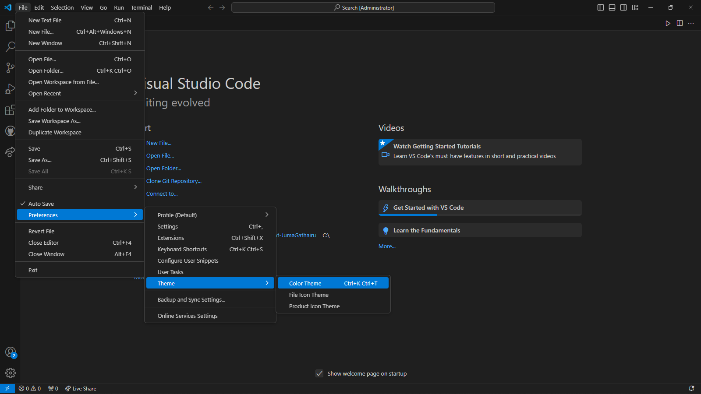
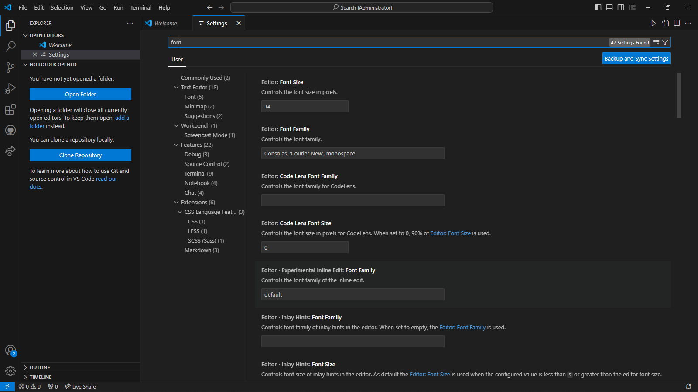
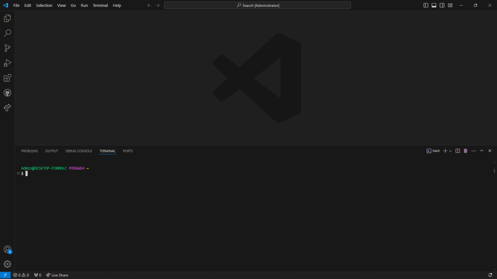
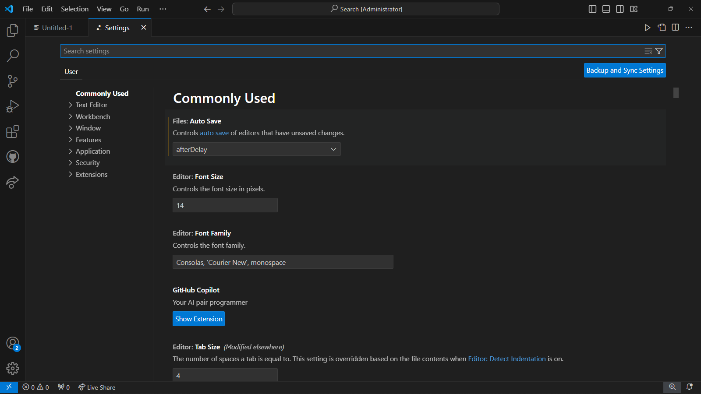
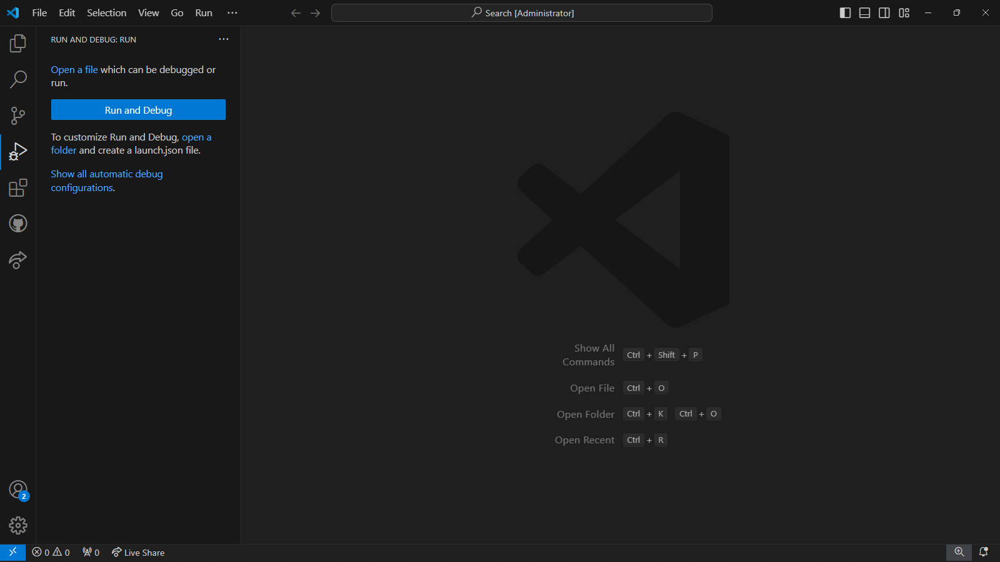

# SE-Assignment-5
Installation and Navigation of Visual Studio Code (VS Code)
 Instructions:
Answer the following questions based on your understanding of the installation and navigation of Visual Studio Code (VS Code). Provide detailed explanations and examples where appropriate.

 Questions:

1. Installation of VS Code:
   - Describe the steps to download and install Visual Studio Code on Windows 11 operating system. Include any prerequisites that might be needed.

2. First-time Setup:
   - After installing VS Code, what initial configurations and settings should be adjusted for an optimal coding environment? Mention any important settings or extensions.

3. User Interface Overview:
   - Explain the main components of the VS Code user interface. Identify and describe the purpose of the Activity Bar, Side Bar, Editor Group, and Status Bar.

4. Command Palette:
   - What is the Command Palette in VS Code, and how can it be accessed? Provide examples of common tasks that can be performed using the Command Palette.

5. Extensions in VS Code:
   - Discuss the role of extensions in VS Code. How can users find, install, and manage extensions? Provide examples of essential extensions for web development.

6. Integrated Terminal:
   - Describe how to open and use the integrated terminal in VS Code. What are the advantages of using the integrated terminal compared to an external terminal?

7. File and Folder Management:
   - Explain how to create, open, and manage files and folders in VS Code. How can users navigate between different files and directories efficiently?

8. Settings and Preferences:
   - Where can users find and customize settings in VS Code? Provide examples of how to change the theme, font size, and keybindings.

9. Debugging in VS Code:
   - Outline the steps to set up and start debugging a simple program in VS Code. What are some key debugging features available in VS Code?

10. Using Source Control:
    - How can users integrate Git with VS Code for version control? Describe the process of initializing a repository, making commits, and pushing changes to GitHub.

    1. Installation of Visual Stusio Code:
    Steps:
     1. Visit the official website - https://code.visualstudio.com/ 

     2. Download the installer by pressing "Download for windows " button

     3. Run the installer by double clicking it to run the installation 
     wizard

     4. Follow the installation wizard which has he following steps:
        - Accept License agreement and click next
        - Choose the installation location click next
        - Select additional tasks, such as creating a desktop icon,addimg a path 
        
     5. Comple the installation by clicking install the finish.

        

    2. First-time Setup
    Steps:
       1. Theme and appearance:
        Navigate to File - Prference - Color Theme and select the suitable theme
        

       2. Extensions:
        Access the extentension view by selecting the icon on the left icon pane and download essential extensions.
        e.g. Prettier (Code formatting)
             Python (Python language support)
             VSCode Icons (Adds icons to files in VS Code)

        .png>)

       3. Editor Settings:
        Adjust editor settings by navigating File - Preference - Settings:
        Here you can change font
        
    
    3. User Interface Overview:
       1. Activity Bar - It is located on the far left. It contains icons for various views i.e Explprer, search, Run , Debug and Extensions

       2. Side Bar - Main panel next to the Activity Bar which display views and panels corresponding to the selected activity

       3. Editor Group - Central area whre files are opened and edited files can be opened side by side

       4. Status bar - located at the bottom, it displays insformation about the current workspace.

    4. Command Palette:
       A powerful tool in VS code used to acces commands
       Accessed by pressing Ctrl+shift+p or F1

       Common Tasks Using the Command Palette
        - Opening files: File: Open File

        - Installing extensions: Extensions: Install Extensions

        - Running tasks: Tasks: Run Task

        - Formatting code: Format Document

        - Changing color theme: Preferences: Color Theme

        

    5. Extensions in VS Code:
       Extensions Enhance the functionality of VS Code by adding support for new languages, themes, debuggers, and tools

       Finding Extensions - Click the Extensions icon in the Activity Bar or press Ctrl + Shift + X

       Installing Extensions - In the Extensions view, search for the desired extension and click the "Install" button.

       Managing Extensions - View installed extensions in the Extensions view.Disable or uninstall extensions by clicking the gear icon next to each extension.

       Essential Extensions for Web Development:
         - Prettier: Code formatter.
         - Debugger for Chrome: Debugging JavaScript code in Chrome
         - GitLens: Enhances Git capabilities
         - VSCode Icons: Adds file icons

      -1.png>)

    6. Intergrated Terminal:
       Used to Run command-line tasks directly within VS Code without switching context.

       Opening: Go to View - Terminal or press Ctrl + backtick

       Avantages:
         1. Direct interaction with project files.

         2. Supports multiple terminal sessions.

         3. Provides a consistent environment within the editor.

         4. Integrated with VS Code features

         
   
    7. File and Folder Management:
       Involves the following processes:
       1. Create - Right-click in the Explorer view and select "New File" or New Folder

       2. Open -Double-click a file in the Explorer view to open it in the Editor.

       3. Navigate -  Use Ctrl+P to quickly open files by name. Navigate between files using Ctrl+Tab.

    8. Settings and Preferences:
       Access Settings through - Go to File - Preferences - Settings 
       E.g.
       Change Theme: File - Preferences - Color Theme.

       Font Size: Search for "Font Size" and adjust.

       Keybindings: Customize via File - Preferences - Keyboard Shortcuts.

       

    9. Debugging in VS Code:
       Set up:
       - Open Debug View - Ctrl+Shift+D.
         

       - Configure Debugging - Click create a launch.json file link to create configuration.

       - Set Breakpoints - Click in the gutter next to the line numbers.

       - Start Debugging - Click the green play button in the Debug toolbar or press F5.

       Key Debugging Features:
       1. Breakpoints - Pause execution at specific lines.

       2. Watch - Monitor variables and expressions.

       3. Call Stack - View the call stack and navigate through function calls.

       5. Variables - Inspect the current state of variables.

       6. Debug Console - Execute commands and evaluate expressions during debugging.

   10. Using Source Control
       Intergrating Git with VS Code:
       1. Initiate Repository:
             - Open the Source Control view by clicking the Source Control icon in the Activity Bar.
             - Click "Initialize Repository" to create a new Git repository.

       2. 

          

 Submission Guidelines:
- Your answers should be well-structured, concise, and to the point.
- Provide screenshots or step-by-step instructions where applicable.
- Cite any references or sources you use in your answers.
- Submit your completed assignment by 1st July 

